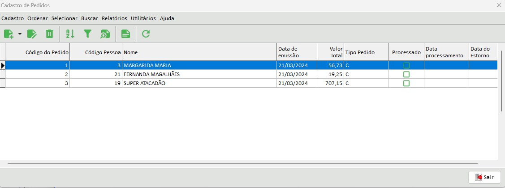

# Gerenciador Empresarial

Trata-se de um pequeno projeto, que tem o intuito de demonstrar o controle de estoque, bem como vendas e compras, cadastro de pessoas (clientes e fornecedores) de um modo bem simples. Seguindo poucas regras de negócio aplicadas.

Por meio desta solução é possível trabalhar a questão dos relacionamentos entre as tabelas, normalização do banco de dados, controle explícito de transações quando envolve mais de uma tabela, entre outras técnicas.

Foi utilizado a IDE Lazarus e todos os componentes são nativos, com exceção apenas dos componentes:

* TCurrencyEdit e TRXDbGrid, ambos da paleta de componentes RX. 

O banco de dados de dados utilizado é o Firebird 3.0 e o escript para criação do banco encontra-se nos arquivos deste repositório, sob nome: "esquema_bd.sql".

---
## Importante:
*A implementação da solução ainda não terminou (em breve ela estará integralmente implementada)*.  
---

Abaixo, segue algumas telas da aplicação:

